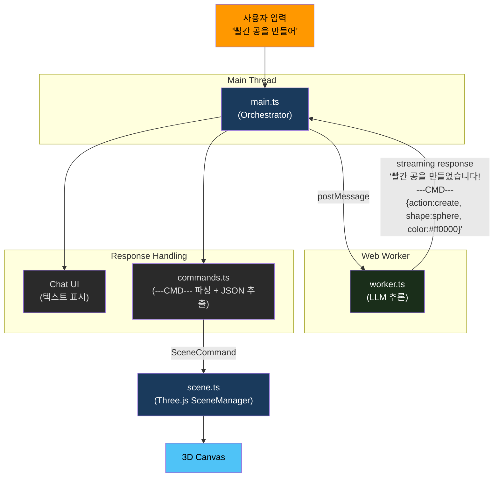
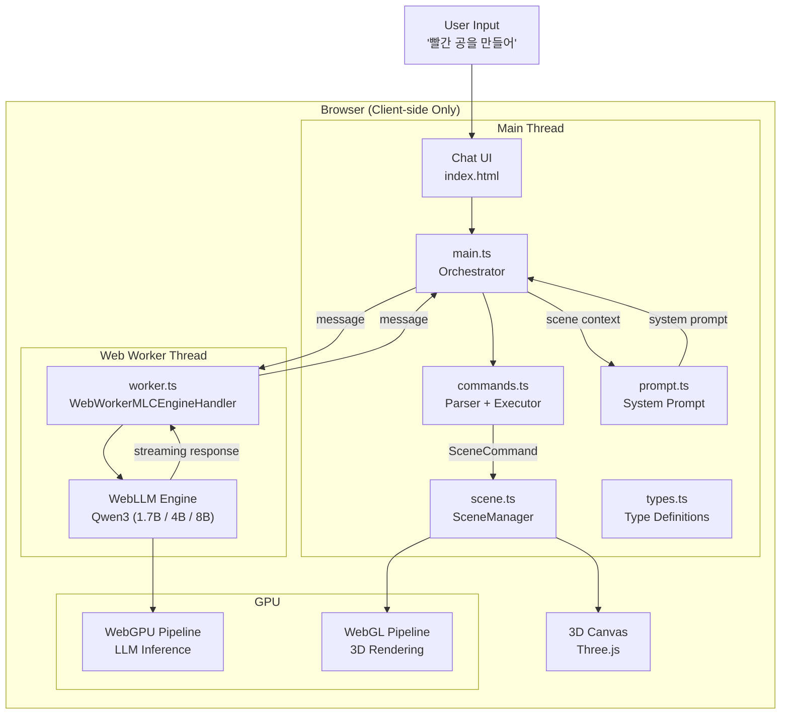
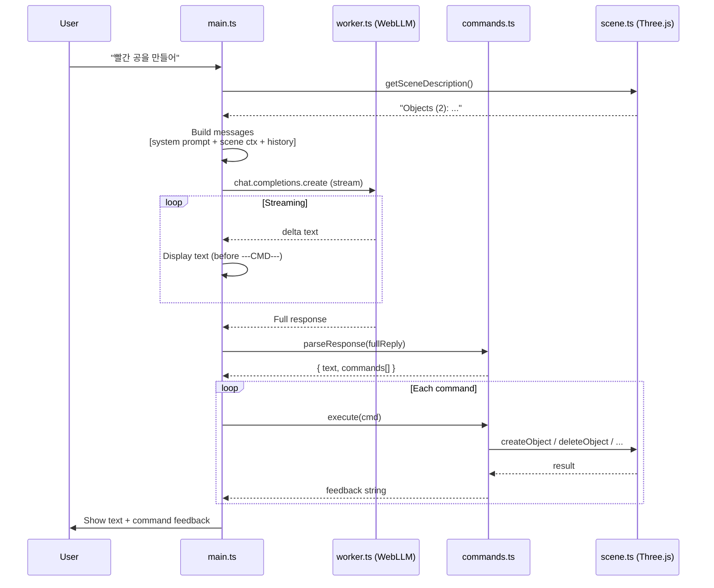
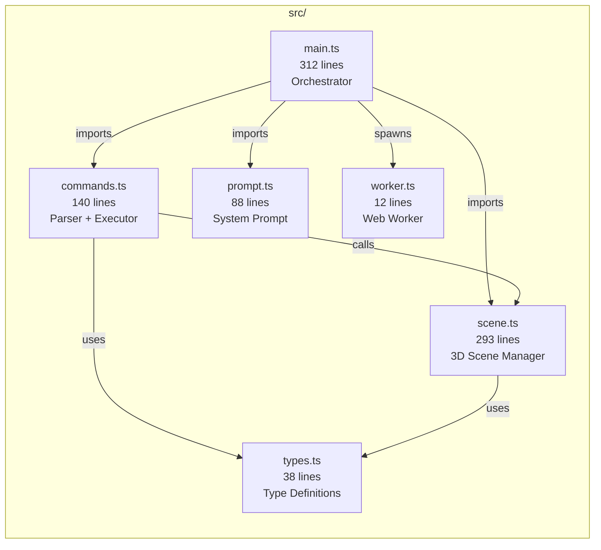
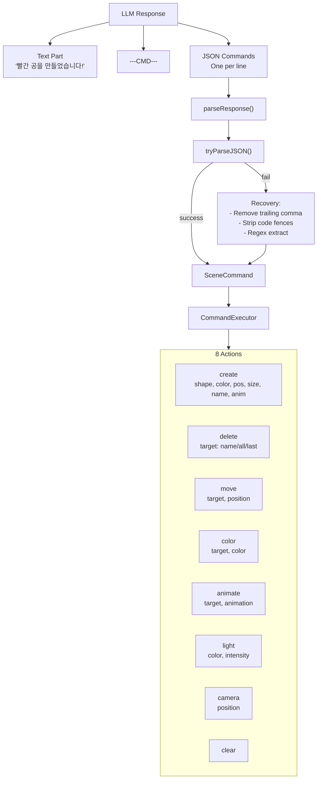
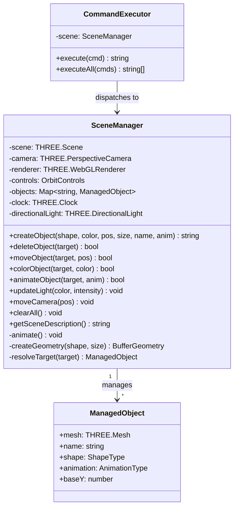
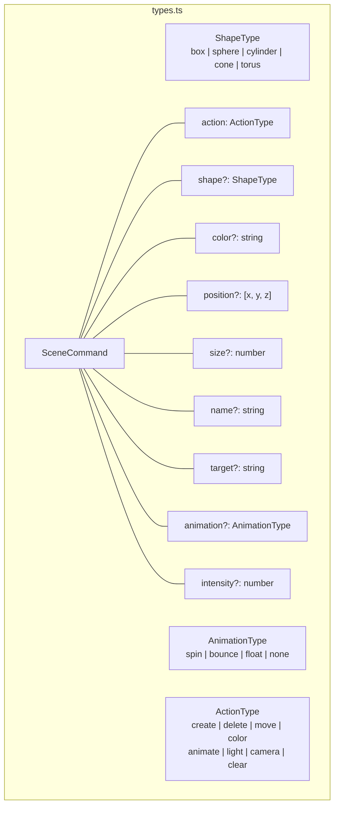
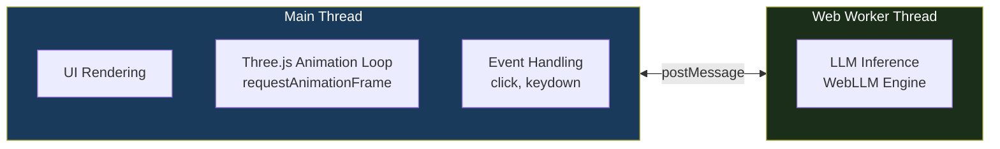

# AI 3D Commander - Architecture Summary

## Overview

자연어로 3D 씬을 조작하는 브라우저 애플리케이션.
WebLLM(WebGPU)으로 LLM 추론, Three.js(WebGL)로 3D 렌더링을 수행하며, 서로 다른 GPU 파이프라인을 사용하여 충돌 없이 동시 동작한다.

## Pipeline Overview

사용자 입력이 3D Canvas에 반영되기까지의 전체 파이프라인.

## System Architecture

## Data Flow

## Module Structure

## Command Protocol

## Scene Manager Class

## Type System

## Threading Model

Main Thread에서 Three.js 렌더링 루프(`requestAnimationFrame`)가 60fps로 동작하고,
Web Worker에서 LLM 추론이 병렬로 실행되어 UI가 블로킹되지 않는다.

## Model Options

| Model | Size | VRAM | Trade-off |
|-------|------|------|-----------|
| Qwen3 1.7B | 1.7B params | ~1.5GB | 빠른 응답, 기본 품질 |
| Qwen3 4B | 4B params | ~3GB | 균형잡힌 성능 |
| Qwen3 8B | 8B params | ~5GB | 최고 품질, 느린 로딩 |

## Key Design Decisions

1. **GPU Pipeline Separation** - Three.js(WebGL)와 WebLLM(WebGPU)이 별도 파이프라인 사용
2. **Worker Isolation** - LLM 추론을 Web Worker로 분리하여 렌더링 프레임레이트 보장
3. **Lightweight Model** - "자연어 -> JSON" 패턴 변환은 단순 작업이므로 1.7B 모델로도 충분
4. **Scene Context Injection** - 매 요청마다 현재 씬 상태를 LLM에 전달하여 상대 참조 해석 가능
5. **Fault-tolerant Parsing** - LLM의 불완전한 JSON 출력을 복구 시도 (trailing comma, code fence 제거)
6. **Streaming UX** - 응답 중 텍스트만 실시간 표시, `---CMD---` 이후 JSON은 사용자에게 숨김
